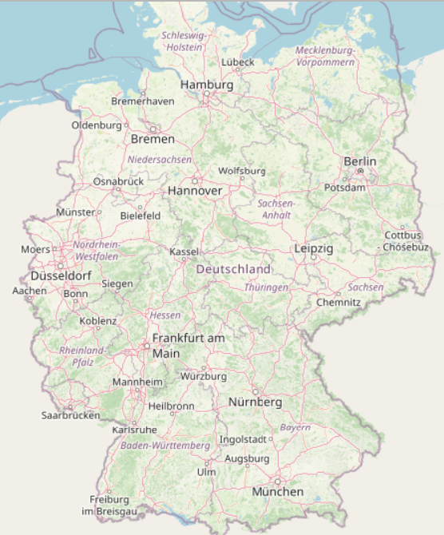
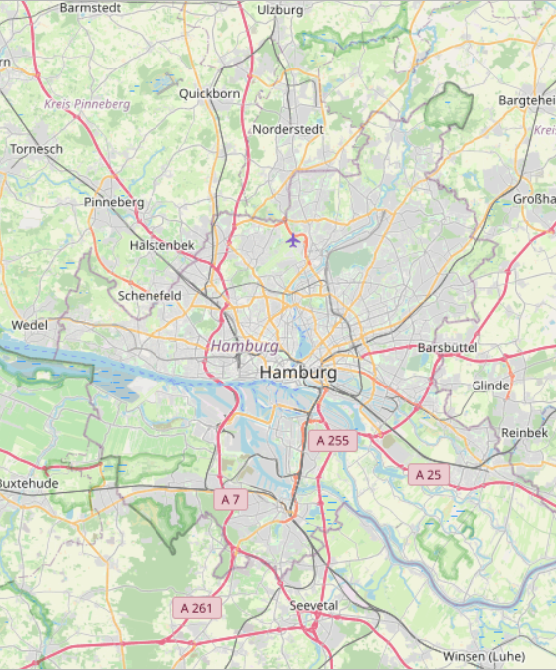
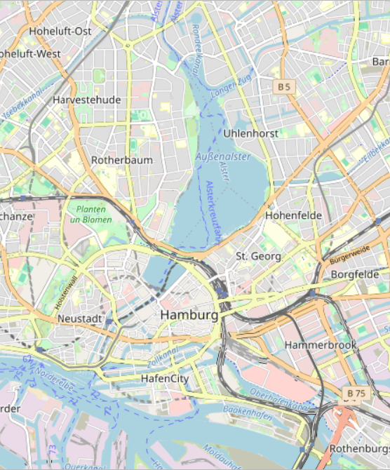
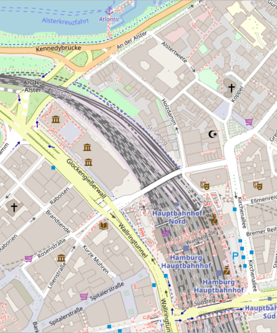
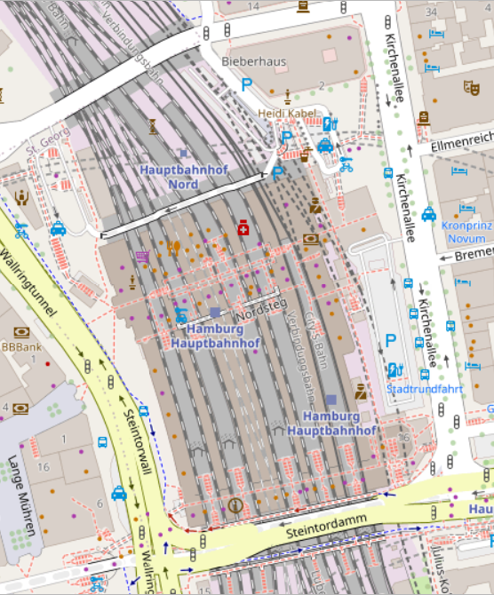

# OSM Germany – Selbstgehosteter Tile-Server

Ein vollautomatisiertes Setup zum Importieren, Rendern und Bereitstellen von OpenStreetMap-Kacheln für Deutschland.
Basierend auf [switch2osm](https://switch2osm.org/) (Anleitung zum Aufbau eigener Tile-Server), **mod_tile** (Apache-Modul zur Bereitstellung von Mapnik-Tiles) und **renderd** (Daemon zur Steuerung des Tile-Renderings) sowie OSM-Daten von **Geofabrik**.

**Ausgangsdaten:** [https://download.geofabrik.de/europe/germany-latest.osm.pbf](https://download.geofabrik.de/europe/germany-latest.osm.pbf)

---

## Projektübersicht

OSM Germany ermöglicht den Aufbau eines lokalen Tile-Servers inklusive:

* Vollständiger OSM-Datenimport für Deutschland
* Flexibles Mapnik-Rendering über `openstreetmap-carto`
* Selektives Rendering geänderter Tiles für Performance
* Schnelle Wiederherstellung veralteter Tiles ohne Update
* Kontinuierliche Replikation und Updates optional
* Zentrale Konfiguration über JSON- und Shell-Skripte
* Einheitliche Ordnerstruktur für Verwaltung, Import, Replikation und Rendering

---

## Notwendige Ordner

```
/switch2osm/
/bigdata/import/osm/karte_germany_osm
/bigdata/export/world/mod_tile
/switch2osm/admin
/switch2osm/import
/switch2osm/mapnik
/switch2osm/osm_replication
/switch2osm/params
/switch2osm/settings
/switch2osm/src
/opt/osm2pgsql
```

Diese Ordner müssen existieren und die entsprechenden Berechtigungen haben, z.B. Eigentümer `_renderd`.

---

## Notwendige Software & Installation

### Grundinstallation

```bash
sudo apt update && sudo apt upgrade -y
sudo apt install -y build-essential cmake git wget unzip bzip2 tar curl screen locate apache2 libapache2-mod-tile renderd mapnik-utils lua5.4 python3-mapnik python3-psycopg2 python3-yaml gdal-bin npm fonts-noto-cjk fonts-noto-hinted fonts-noto-unhinted fonts-unifont postgresql postgis postgresql-18-postgis-3 postgresql-18-postgis-3-scripts net-tools perl parallel
```

### Installieren von mod_tile und renderd

```bash
sudo apt install -y libapache2-mod-tile renderd
sudo systemctl enable renderd
sudo systemctl start renderd
```

### Installieren und Kompilieren von osm2pgsql

* Siehe Skript: `compile_osm2pgsql/dev_OSM2PGSQL.sh`
* Installiert osm2pgsql unter `/opt/osm2pgsql`
* Prüfen der Version:

```bash
/opt/osm2pgsql/bin/osm2pgsql --version
```

---

## Projektstruktur

```
.
├── admin
│   ├── create_germany.sh
│   ├── refreshTiles.sh
│   └── tiles_germany.sh
├── compile_osm2pgsql
│   └── dev_OSM2PGSQL.sh
├── import
│   ├── import_fonts.sh
│   └── import_germany.sh
├── mapnik
│   └── germany.xml
├── osm_germany.qgz
├── osm_replication
│   ├── expire_tiles_germany.sh
│   ├── init_germany.sh
│   └── update_tiles_germany.sh
├── params
│   ├── db_params.sh
│   ├── productlist.json
│   └── readParams.py
├── README.md
├── settings
│   ├── openstreetmap-carto-flex.lua
│   ├── readme.txt
│   ├── renderd.conf
│   └── render_list_geo.pl
└── src
```

---

## Skripte & Konfiguration

### admin/create_germany.sh

Initialisiert die Datenbank, installiert Abhängigkeiten, importiert OSM-Daten und erstellt die Mapnik-XML.

### admin/refreshTiles.sh

Setzt Besitzerrechte und Zugriffsrechte für Tiles, aktualisiert den Cache und startet Renderd neu.

### admin/tiles_germany.sh

Startet den Tile-Render-Prozess für definierte Zoomstufen und geographische Bereiche; **funktioniert nur nach Datenimport oder bei aktivierter Replikation**.

### import/import_germany.sh

Lädt das neueste Germany PBF von Geofabrik herunter.

### import/import_fonts.sh

Installiert zusätzliche Schriftarten für Mapnik.

### osm_replication/init_germany.sh

Initialisiert die Replikation der OSM-Daten für Deutschland.

### osm_replication/update_tiles_germany.sh

Aktualisiert die OSM-Datenbank anhand der Replikation und markiert geänderte Tiles.

### osm_replication/expire_tiles_germany.sh

Verarbeitet die Dirty Tiles Liste und entfernt/verändert veraltete Tiles.

### params/db_params.sh

Liest die Datenbankparameter aus `productlist.json` und exportiert Umgebungsvariablen.

### params/productlist.json

Enthält Metadaten zu den Geo-Produkten (Deutschland, Italien) inkl. Datenbank-Zugangsdaten.

### params/readParams.py

Python-Skript zum Auslesen von Datenbankparametern aus `productlist.json`.

### settings/openstreetmap-carto-flex.lua

Flexibles Tag-Transformationsskript für osm2pgsql, definiert die DB-Spalten und Datenstruktur.

### settings/renderd.conf

Konfiguration für Renderd/mod_tile, definiert Socket, Threads, Tile-Verzeichnisse und Mapnik XML.

### settings/render_list_geo.pl

Perl-Skript für das Rendering geographischer Bereiche in Batches, unterstützt mehrere Threads und Zoomstufen.

### compile_osm2pgsql/dev_OSM2PGSQL.sh

Skript zum Kompilieren und Installieren von osm2pgsql in `/opt/osm2pgsql`.

---

## Workflows

### 1. Vollständiger Import und Rendering

1. OSM-Daten herunterladen: `import/import_germany.sh`
2. Datenbank erstellen und importieren: `admin/create_germany.sh`
3. Tiles rendern: `admin/tiles_germany.sh`
4. Karte ist danach im Tile-Server sichtbar

### 2. Tiles zurücksetzen ohne Update

* `admin/refreshTiles.sh` ausführen, um alle Tiles auf „nicht dirty“ zu setzen
* Dies ermöglicht schnellen Zugriff auf die Karten, ohne aktuelle Änderungen zu übernehmen

### 3. Replikation & kontinuierliche Updates

1. Replikation initialisieren: `osm_replication/init_germany.sh`
2. Updates anwenden: `osm_replication/update_tiles_germany.sh`
3. Tiles rendern: `admin/tiles_germany.sh`
4. Karte ist danach aktualisiert und auf dem neuesten Stand

---

## Hinweise

* Alle Skripte setzen sudo Rechte voraus.
* Tile-Rendering kann mehrere Stunden dauern, je nach Zoomstufe und Hardware.
* Font- und Mapnik-Fehler vermeiden, indem `import/import_fonts.sh` ausgeführt wird.
* Anpassung der Zoomstufen und geografischen Grenzen erfolgt in `tiles_germany.sh`.
* Stellen Sie sicher, dass alle notwendigen Ordner existieren und die Berechtigungen korrekt gesetzt sind.
* Renderd muss nach Änderungen der Tiles oder Konfiguration neu gestartet werden.
* `osm2pgsql` muss kompiliert und unter `/opt/osm2pgsql` installiert sein, bevor der Datenimport erfolgt.

---

## Setup / Rechenzeiten 

| Hardware | CPU                     | RAM   | SSD  | Virtualisierung             |
| -------- | ----------------------- | ----- | ---- | --------------------------- |
| Setup-PC | Intel i7-8700K, 6 Cores | 61 GB | 1 TB | VMware Workstation Pro 25H2 |

| Zoomstufe | geschätzte Renderzeit |
| --------- | --------------------- |
| 1 - 12    | 64 Minuten            |
| 13 - 15   | 115 Minuten           |
| 16        | 130 Minuten           |
| 17        | 356 Minuten           |

> Hinweis: Zeiten dienen als Richtwert für die angegebene Hardware und 6 Threads.

---

## Screenshots von Hamburg - div. Zoomstufen







---

## Lizenz

Projekt kann unter MIT-Lizenz oder Open-Source Lizenz genutzt werden, abhängig von den verwendeten Daten von OpenStreetMap.
